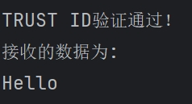
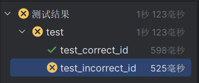
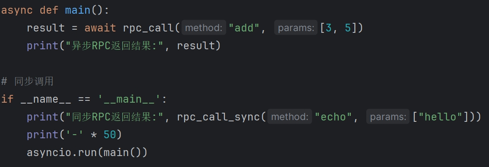
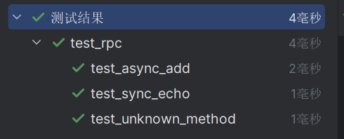

# 可信Socket通信系统

## 效果展示：
- 预期成功输出

```
服务器启动，TRUST ID为：1000
TRUST ID验证通过！
接收的数据为: 
Hello
```




## 项目概述
实现基于环境变量/文件的身份验证机制的安全Socket通信系统，包含服务端、客户端和自动化测试模块。

## 功能特性
- 基于TRUST_ID的双向验证机制
- 环境变量与文件双模式配置
- 自动化测试覆盖

## 开发环境版本
- Python 3.12.7
- Anaconda 24.11.3
- 操作系统：Windows 23H2

## 运行说明
1. 配置身份凭证
- 配置服务端凭证(示例值：1000，默认已配置好)

`echo '1000' > server_trust_id.txt`

- 配置客户端凭证(需与服务端一致，默认也已配置好)

`echo "server_secret" > client_trust_id.txt`

- 可选：通过环境变量配置 (临时生效)：

`set TRUST_ID=server_secret`

2. 运行服务端
默认监听 127.0.0.1:8888

`python server.py`


3. 运行服务端

`python client.py`

4. 运行测试用例
- 安装测试依赖

`pip install pytest pytest-asyncio`

- 运行所有测试

`pytest test.py -v`

- 查看实时测试输出

`pytest test.py -v --capture=no`

服务端与客户端使用相同TRUST_ID时，测试通过

两者ID不同时，测试失败

成功验证该项目系统的可行性


### 附：项目结构示意图
```
trust-socket/
├── 📁 rpc_project/           # RPC(Remote Procedure Call)系统
├── 📄 server.py              # 服务端主程序
├── 📄 client.py              # 客户端主程序
├── 📄 read_id.py             # 凭证读取模块
├── 📄 test.py                # 自动化测试
├── 📄 server_trust_id.txt    # 服务端TRUST_ID
├── 📄 client_trust_id.txt    # 客户端TRUST_ID
├── 📄 trust_id.txt           # 默认TRUST_ID
└── 📄 README.md              # 项目说明文档
```
> 💡 提示：首次运行时建议保持默认配置，验证基础功能正常后再进行自定义配置

### 附：RPC系统演示效果图


客户端请求的示例函数为原样返回、以及两数相加两个函数



其结果为


测试程序结果为



在调用不存在的函数时，也能提示相应函数不存在

